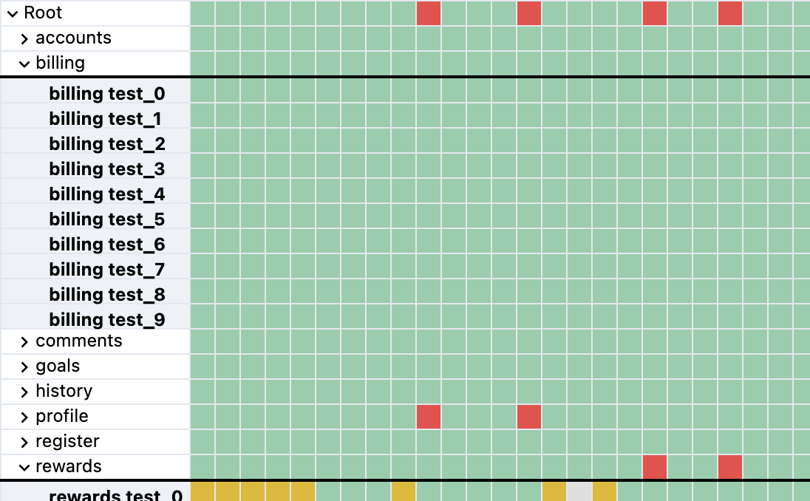

# Example node test suite

This generates a suite of tests that are passed, skipped, and failed. Running `npm run test` is expected to fail tests sometimes.

## Quickstart

We will download the testrecall-reporter CLI. Afterwards we will run our test suite, that outputs a `report.xml` output. Finally we upload the results using the testrecall reporter.

```bash
curl -sL https://get.testrecall.com/reporter | bash
export TR_UPLOAD_TOKEN="fill_me_in"

npm install
npm run test

testrecall-reporter
```

You should now see something like this in your project view!



## Usage

Each suite is configured with a few properties for demo purposes:

- test suite name
- number of tests to generate and run
- test fail rate
- test skip rate
- test miss rate
